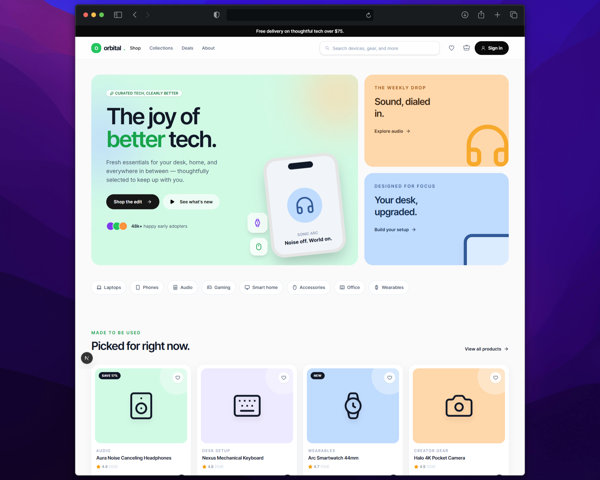

# Orbital Shop

A modern, responsive ecommerce storefront for thoughtfully curated electronics, gadgets, and smart-home products.

<!-- Replace YOUR_DEPLOYMENT_URL with the verified production URL before publishing. -->
**[Live Demo](YOUR_DEPLOYMENT_URL)** · **[Repository](https://orbital-shop.hishamkhaled.com)**



## About

Orbital Shop is a polished frontend shopping experience designed to make discovering useful technology feel simple. It combines a spacious, premium homepage with a practical product catalogue for browsing devices across work, home, audio, gaming, and everyday carry.

## Highlights

- Responsive storefront with a curated, promotion-led homepage
- Searchable product catalogue with category and price filters
- Featured, newest, rating, and price-based sorting
- URL-driven filters and pagination with shareable catalogue states
- Responsive filter drawer and dedicated loading, empty, and error states
- Interactive favourites and cart feedback on the homepage
- Semantic, keyboard-accessible controls with visible focus states
- Feature-based architecture built on the Next.js App Router

## Tech Stack

- [Next.js 16](https://nextjs.org/) and [React 19](https://react.dev/)
- [TypeScript](https://www.typescriptlang.org/)
- [Tailwind CSS 4](https://tailwindcss.com/)
- [Framer Motion](https://motion.dev/)
- [Base UI](https://base-ui.com/) and [Radix Icons](https://www.radix-ui.com/icons)
- [Vitest](https://vitest.dev/) and [Testing Library](https://testing-library.com/)

## Getting Started

### Prerequisites

- [Node.js](https://nodejs.org/) 20 or later
- [pnpm](https://pnpm.io/) 10

### Run locally

```bash
git clone https://github.com/hishamk1999/orbital-shop.git
cd orbital-shop
pnpm install
pnpm dev
```

Open [http://localhost:3000](http://localhost:3000) to view the storefront.

## Available Scripts

| Command | Description |
| --- | --- |
| `pnpm dev` | Start the local development server |
| `pnpm build` | Create a production build |
| `pnpm start` | Run the production build |
| `pnpm lint` | Check the project with ESLint |
| `pnpm typecheck` | Run TypeScript without emitting files |
| `pnpm test:run` | Run the Vitest test suite once |

## Project Structure

```text
orbital-shop/
├── public/
│   └── images/          # Repository and storefront imagery
└── src/
    ├── app/             # Next.js routes and app-level files
    ├── features/        # Domain-owned pages, components, data, and tests
    └── shared/          # Reusable UI, layouts, and utilities
```

## Author

Designed and built by [Hisham Khaled](https://www.hishamkhaled.com/).
